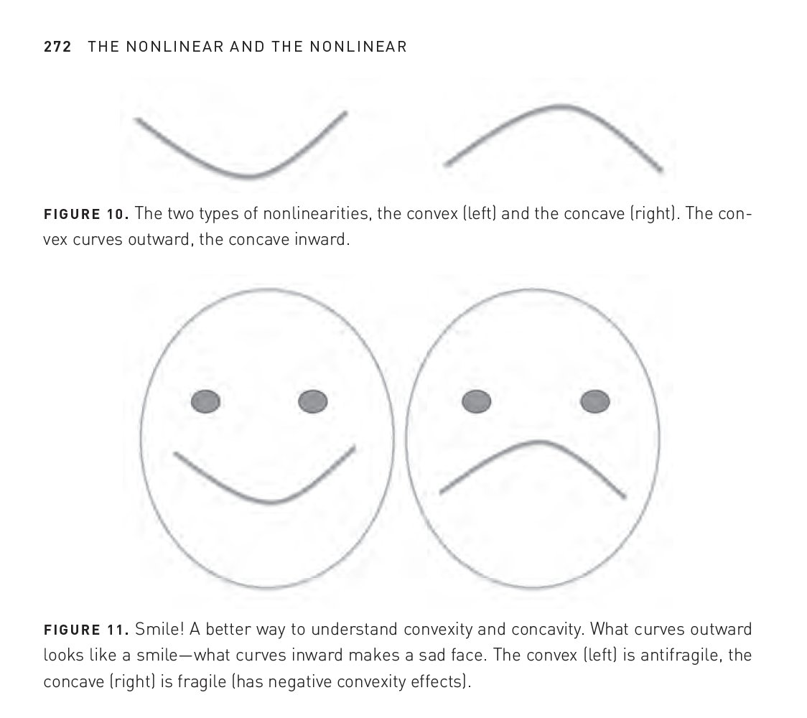

# 18장: 비선형

## 각기 다른 새로운 것이 없다는 피드백

여러 사람이 '여기에는 새로운 것이 없다'라고 쓰고는 모두가 다른 이유를 제시한다면,
우리는 '실제로 거기에 새로운 것이 있다고' 단언해도 된다.

## 오목

## 볼록성 효과로 안티프래질 판별하기

어떤 대상에 대한 노출을 두 배로 늘렸을 때, 그 피해가 두 배보다 더 큰가?

## 효율성은 프래질하다

블랙 스완 효과는 복잡성, 구성 요소 간의 상호의존성, 세계화, 그리고 사람들이 아슬아슬한 모험을 하게 만드는 효율성이라는 끔찍한 유혹 때문에 더욱 커지게 되어 있다.
